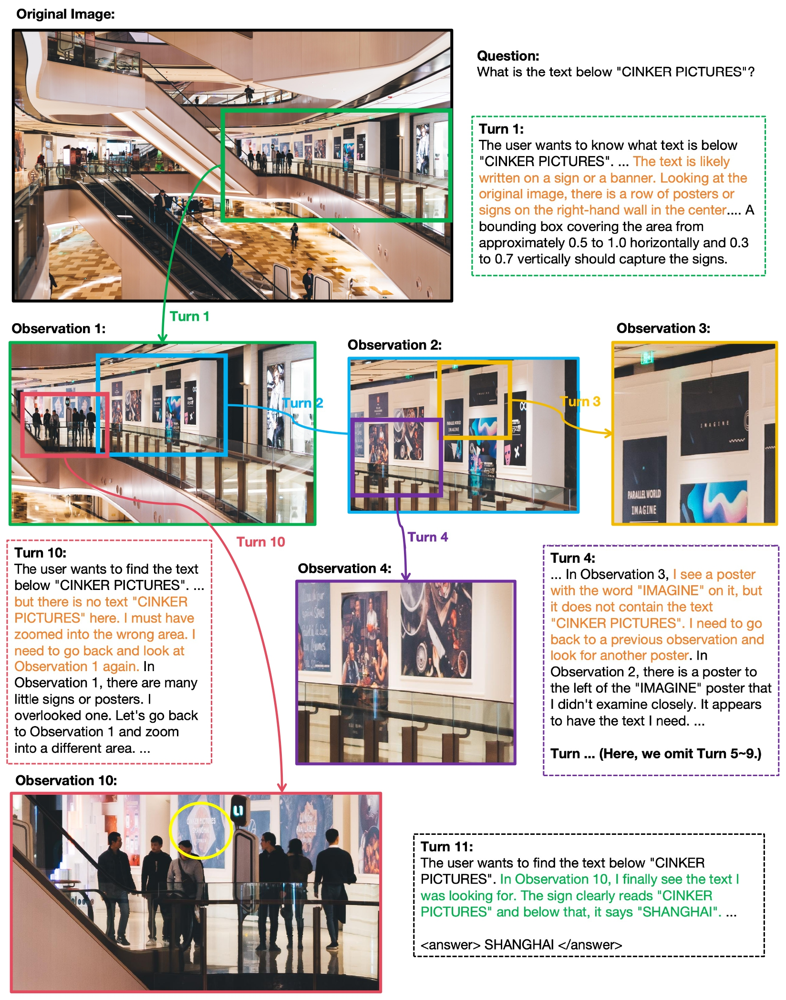
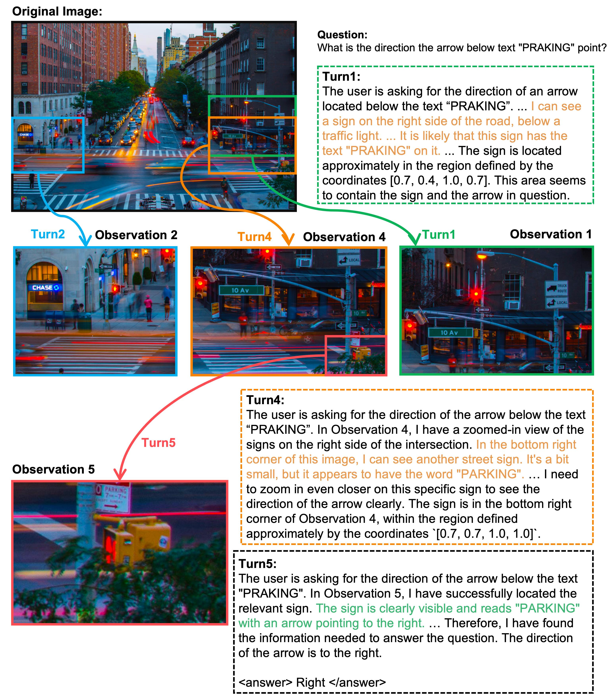
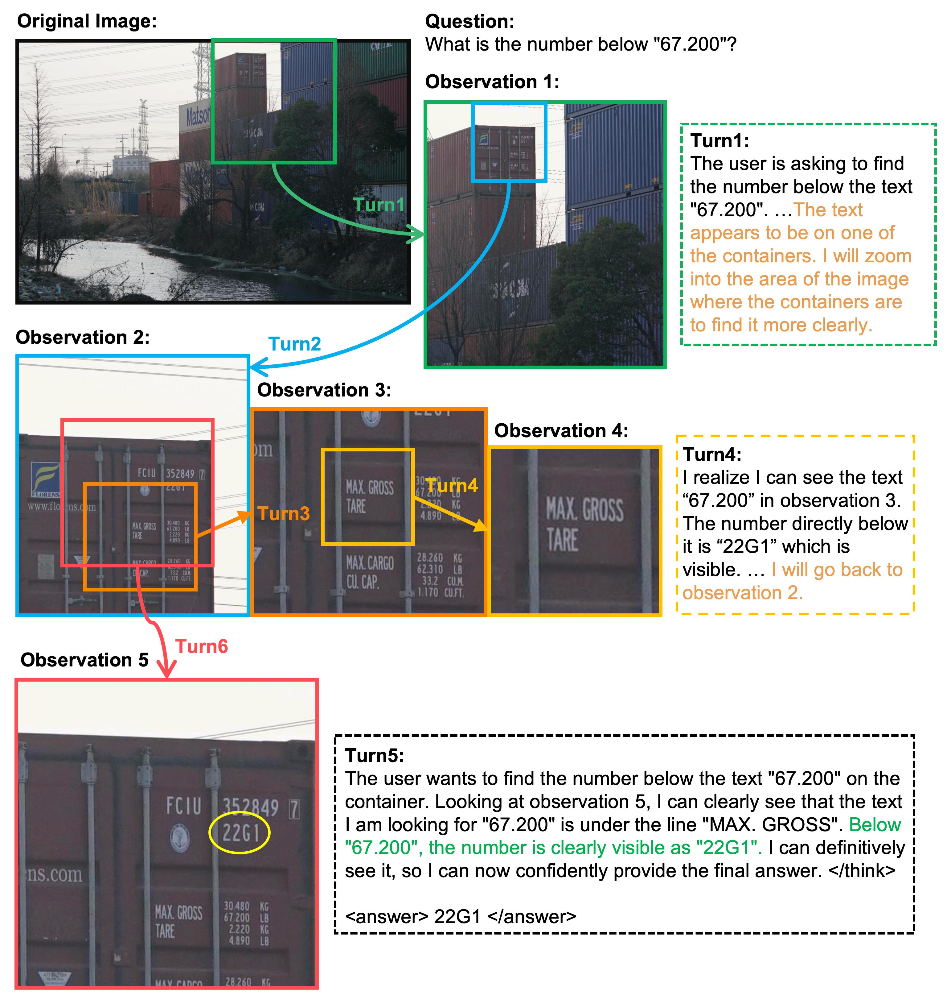
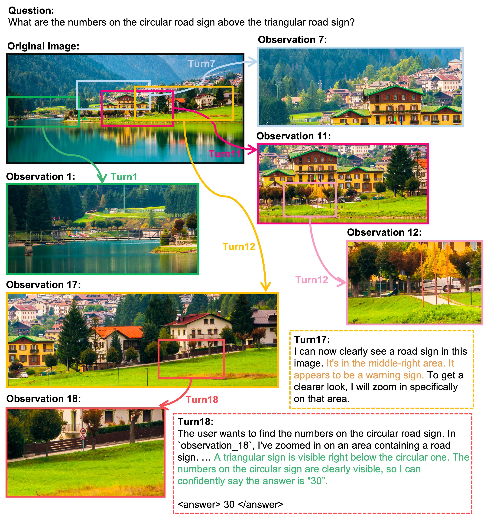

# Mini-o3: Scaling Up Reasoning Patterns and Interaction Turns for Visual Search

<a href='https://mini-o3.github.io/'></a>
<a href='https://arxiv.org/pdf/2509.07969'></a>
<a href='https://huggingface.co/Mini-o3/models'></a>
<a href='https://huggingface.co/Mini-o3/datasets'></a>

This repository releases the official code for Mini-o3. We achieve the state-of-the-art results on various benchmarks and present a full training recipe to reproduce the OpenAI o3-style deep multi-turn “thinking-with-images” capability. The training code is based on [verl](https://github.com/volcengine/verl.git).

## Release
- [2025/09/10] 🔥 Mini-o3 is coming! We release the [paper](https://arxiv.org/pdf/2509.07969), [code](https://github.com/Mini-o3/Mini-o3), [models](https://huggingface.co/Mini-o3/models), and [data](https://huggingface.co/Mini-o3/datasets)!

## Contents
- [Install](#install)
- [Model](#model)
- [Train](#train)
- [Evaluation](#evaluation)
- [Examples](#examples)
- [Citation](#citation)
- [Acknowledgement](#acknowledgement)
- [License](#license)

## Install
Please follow the instructions below to install the required packages.

1. Clone this repository
```bash
git clone https://github.com/Mini-o3/Mini-o3.git
```

2. Install Package
```bash
conda create -n minio3 python=3.10 -y
conda activate minio3
cd Mini-o3
pip install -e .
pip install vllm==0.9.2
```

---

## Model

| Training Phase | Model | HuggingFace |
|----------|----------|----------|
| Cold-start SFT | Mini-o3-7B-SFT | https://huggingface.co/Mini-o3/Mini-o3-7B-SFT | 
| RL | Mini-o3-7B-v1 | https://huggingface.co/Mini-o3/Mini-o3-7B-v1 | 

---

## Train

Training consists of two stages.

### Stage 1: Cold-start Supervised Fine-tuning (SFT)

We recommend to use the popular [LLaMA-Factory](https://github.com/hiyouga/LLaMA-Factory) to perform SFT on our cold-start data. We use [Qwen2.5-VL-7B-Instruct](https://huggingface.co/Qwen/Qwen2.5-VL-7B-Instruct) as the base model.

1. Install [LLaMA-Factory](https://github.com/hiyouga/LLaMA-Factory).
2. Use the script `scripts/preprocess_coldstart.py` to download [Mini-o3-Coldstart-Dataset](Mini-o3/Mini-o3-Coldstart-Dataset) and produce the required data format by LLaMA-Factory. This script automatically extracts images and generates a JSON file from the original parquet-format dataset.
```
python3 scripts/preprocess_coldstart.py --dataset_path Mini-o3/Mini-o3-Coldstart-Dataset --output_dir [YOUR_DATASET_FOLDER]
```
3. After processing, please follow the instructions in LLaMA-Factory to configure the cold-start data in `data/dataset_info.json`, as shown below, then copy the config file `sft_configs/qwen2.5-vl.yaml` into your LLaMA-Factory codebase.
```
"minio3_coldstart": {
  "file_name": "[YOUR_DATASET_FOLDER]/Mini-o3-Coldstart.json",
  "formatting": "sharegpt",
  "columns": {
    "messages": "conversations",
    "images": "images"
  },
  "tags": {
    "role_tag": "from",
    "content_tag": "value",
    "user_tag": "human",
    "assistant_tag": "gpt",
    "system_tag": "system"
  }
}
```
4. Train Cold-start data with the training configs.
```
llamafactory-cli train sft_configs/qwen2.5-vl.yaml
```

### Stage 2: Reinforcement Learning (RL)

The reinforcement learning is based on the coldstart model. You could either use the model produced in stage 1, or directly download it from [Mini-o3-7B-SFT](https://huggingface.co/Mini-o3/Mini-o3-7B-SFT).

```
export API_KEY=[YOUR_API_KEY]
export API_VERSION=[YOUR_API_VERSION]
export END_POINT=[YOUR_END_POINT]
export BASE_IMAGE_DIR=[YOUR_IMAGES_DIR]

VISUALPROBE_TRAIN_DATA=${BASE_IMAGE_DIR}/VisualProbe_train/train.json
DEEPEYES_TRAIN_4K_DATA=${BASE_IMAGE_DIR}/DeepEyes_train_4K/train.json
VSTAR_BENCH_VAL_DATA=${BASE_IMAGE_DIR}/Vstar_Bench/val.json
VISUALPROBE_EASY_VAL_DATA=${BASE_IMAGE_DIR}/VisualProbe_Easy/val.json
VISUALPROBE_MEDIUM_VAL_DATA=${BASE_IMAGE_DIR}/VisualProbe_Medium/val.json
VISUALPROBE_HARD_VAL_DATA=${BASE_IMAGE_DIR}/VisualProbe_Hard/val.json

python3 -m verl.trainer.main_ppo \
    algorithm.adv_estimator=grpo \
    data.system_prompt="tool_crop" \
    data.train_files=[${VISUALPROBE_TRAIN_DATA},${DEEPEYES_TRAIN_4K_DATA}] \
    data.val_files=[${VSTAR_BENCH_VAL_DATA},${VISUALPROBE_EASY_VAL_DATA},${VISUALPROBE_MEDIUM_VAL_DATA},${VISUALPROBE_HARD_VAL_DATA}] \
    data.train_batch_size=256 \
    data.max_prompt_length=8192 \
    data.max_response_length=8192 \
    data.image_key=images \
    data.answer_key=solution \
    data.mask_blank=False \
    data.acc_reward_weight=1.0 \
    data.format_reward_weight=0 \
    data.tool_call_penalty=0 \
    data.general_qa_reward_fn="general_qa_tool_mc" \
    data.gpt_general_qa_reward_fn="general_qa_tool" \
    data.gpt_extract_answer=True \
    data.extract_answer_tags="strict" \
    data.return_raw_chat=True \
    data.gpt_threads=300 \
    data.tool_call="crop" \
    data.use_tgt_size=False \
    data.max_pixels=2000000 \
    data.min_pixels=40000 \
    reward_model.reward_manager=naive_multithreads_tool \
    actor_rollout_ref.actor.ignore_exceed=True \
    actor_rollout_ref.model.path=Mini-o3/Mini-o3-7B-SFT \
    actor_rollout_ref.actor.optim.lr=1e-6 \
    actor_rollout_ref.model.use_remove_padding=True \
    actor_rollout_ref.actor.ppo_mini_batch_size=32 \
    actor_rollout_ref.actor.ppo_micro_batch_size_per_gpu=1 \
    actor_rollout_ref.actor.use_kl_loss=False \
    actor_rollout_ref.actor.kl_loss_coef=0.000 \
    actor_rollout_ref.actor.kl_loss_type=low_var_kl \
    actor_rollout_ref.actor.entropy_coeff=0.000 \
    actor_rollout_ref.model.enable_gradient_checkpointing=True \
    actor_rollout_ref.actor.fsdp_config.param_offload=False \
    actor_rollout_ref.actor.fsdp_config.optimizer_offload=False \
    actor_rollout_ref.actor.use_multi_turn_response_mask=True \
    actor_rollout_ref.rollout.log_prob_micro_batch_size_per_gpu=1 \
    actor_rollout_ref.rollout.tensor_model_parallel_size=1 \
    actor_rollout_ref.rollout.max_num_batched_tokens=32768 \
    actor_rollout_ref.rollout.name=vllm_multi_turn_tool_call \
    actor_rollout_ref.rollout.gpu_memory_utilization=0.6 \
    actor_rollout_ref.rollout.enable_chunked_prefill=False \
    actor_rollout_ref.rollout.enforce_eager=False \
    actor_rollout_ref.rollout.free_cache_engine=False \
    actor_rollout_ref.rollout.n=16 \
    actor_rollout_ref.rollout.max_generation_round=6 \
    'actor_rollout_ref.rollout.limit_mm_per_prompt={'image': 12}' \
    actor_rollout_ref.rollout.val_max_generation_round=12 \
    'actor_rollout_ref.rollout.val_limit_mm_per_prompt={'image': 12}' \
    actor_rollout_ref.rollout.use_raw_image=True \
    actor_rollout_ref.rollout.multi_turn_prompt_type="v2" \
    actor_rollout_ref.rollout.vllm_infer_batch_size=32 \
    actor_rollout_ref.rollout.mode="async" \
    actor_rollout_ref.actor.clip_ratio_high=0.3 \
    actor_rollout_ref.actor.clip_ratio_low=0.2 \
    actor_rollout_ref.rollout.use_relative_coordinates=True \
    actor_rollout_ref.ref.log_prob_micro_batch_size_per_gpu=8 \
    actor_rollout_ref.ref.fsdp_config.param_offload=True \
    algorithm.kl_ctrl.kl_coef=0.001 \
    trainer.critic_warmup=0 \
    trainer.logger=['console','wandb'] \
    trainer.project_name='Mini-o3' \
    trainer.experiment_name='Mini-o3-RL' \
    trainer.val_generations_to_log_to_wandb=512 \
    trainer.n_gpus_per_node=8 \
    trainer.nnodes=1 \
    trainer.save_freq=25 \
    trainer.default_local_dir=./save \
    trainer.test_freq=5 \
    trainer.total_epochs=100 \
    trainer.log_training_rollouts_freq=5 \
    trainer.train_generations_to_log_to_wandb=256 \
    trainer.use_3drope=True \
    reward_model.use_hybrid_reward_manager=True \
    trainer.rejection_sample=True \
    trainer.rejection_sample_multiplier=1
```

---

## Evaluation

### Script
For evaluation, you can directly add the following lines behind the above training command:
```
    actor_rollout_ref.rollout.val_n=32 \
    actor_rollout_ref.rollout.val_do_sample=True \
    trainer.val_only=True
```
Note that the argument `actor_rollout_ref.rollout.val_n` means the `k` in `Avg@k`. If you want to perform greedy sample, set `actor_rollout_ref.rollout.val_n` to `1` and `actor_rollout_ref.rollout.val_do_sample` to `False`.

### Evaluation Results
Mini-o3 (7B) achieves SOTA on visual search benchmarks compared to 7B peers, with strong results on VisualProbe, V* Bench, HR-Bench, and MME-Realworld.

| Model | VisualProbe hard | VisualProbe medium | VisualProbe easy | V* Bench | HR-Bench 4K | HR-Bench 8K | MME-Realworld |
|---|---:|---:|---:|---:|---:|---:|---:|
| GPT-4o | 11.2 | 15.4 | 47.5 | 65.2 | 62.0 | 58.3 | 45.2 |
| LLaVA-OneVision | 13.4 | 12.5 | 36.2 | 70.9 | 61.2 | 54.0 | 57.4 |
| Qwen2.5-VL-Instruct | 23.9 | 26.0 | 39.1 | 75.5 | 68.2 | 62.7 | 57.3 |
| SEAL† | – | – | – | 75.4 | – | – | – |
| DyFo† | – | – | – | 81.2 | – | – | – |
| Chain-of-Focus† | – | – | – | 88.0 | – | – | – |
| Pixel Reasoner‡ | 28.8 | 29.6 | 58.4 | 86.3 | 74.0 | 66.9 | 64.4 |
| DeepEyes‡ | 35.1 | 29.8 | 60.1 | 83.3 | 73.2 | 69.5 | 64.0 |
| Mini-o3 (Ours) | 48.0 | 50.4 | 67.0 | 88.2 | 77.5 | 73.3 | 65.5 |

- † The models only report the metric of Avg@1 and the model weights are not available.
- ‡ Re-evaluated using its official model and evaluation code to yield the metric of Avg@32.

---

## Examples

Mini-o3 demonstrates rich reasoning patterns and deep thinking paths. We provide some examples in this section.

<div align=center>

</div>

<br>

<div align=center>

</div>

<br>

<div align=center>

</div>

<br>

<div align=center>

</div>

---

## Citation

If you find this repo useful for your research, please consider citing the paper
```
@article{lai2025mini-o3,
  title={Mini-o3: Scaling Up Reasoning Patterns and Interaction Turns for Visual Search},
  author={Lai, Xin and Li, Junyi and Li, Wei and Liu, Tao and Li, Tianjian and Zhao, Hengshuang},
  journal={arXiv:2509.07969},
  year={2025}
}
```

---

## Acknowledgement
We would like to thank the following repos for their great work:

- This work is built upon the [verl](https://github.com/volcengine/verl).
- This work utilizes models from [Qwen](https://huggingface.co/Qwen/Qwen2.5-VL-7B-Instruct), and data from [DeepEyes](https://huggingface.co/datasets/ChenShawn/DeepEyes-Datasets-47k).

## License
[](https://github.com/Mini-o3/Mini-o3/blob/main/LICENSE)
[](https://github.com/Mini-o3/Mini-o3/blob/main/DATA_LICENSE)
[](https://github.com/Mini-o3/Mini-o3/blob/main/WEIGHT_LICENSE)

The data and checkpoint is intended and licensed for research use only. They are also restricted to uses that follow the license agreement of Qwen2.5-VL. The dataset is CC BY NC 4.0 (allowing only non-commercial use) and models trained using the dataset should not be used outside of research purposes.
